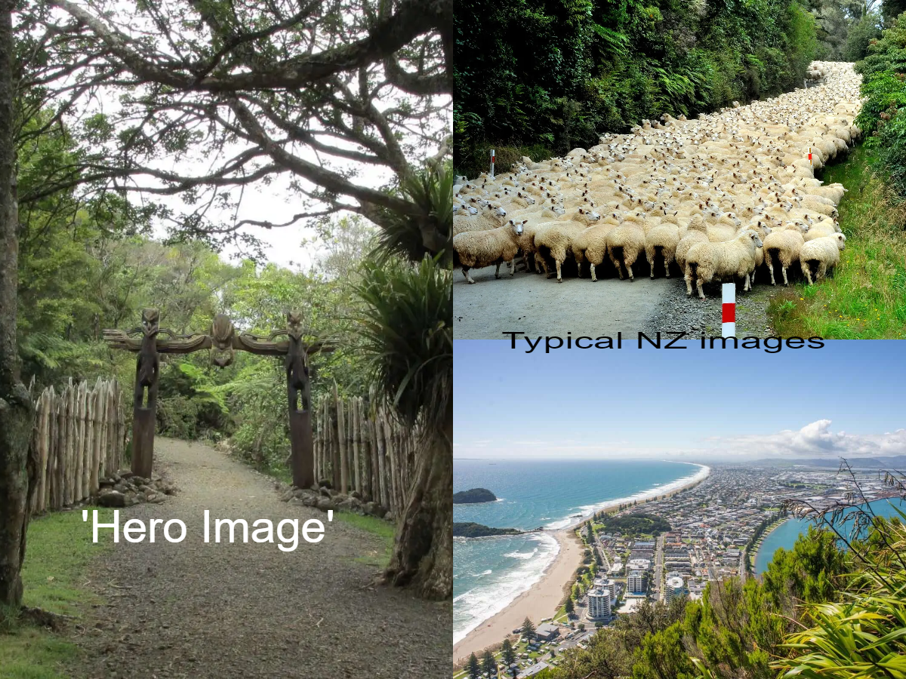
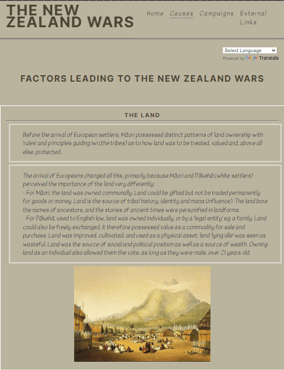
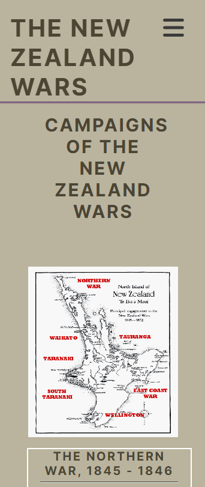
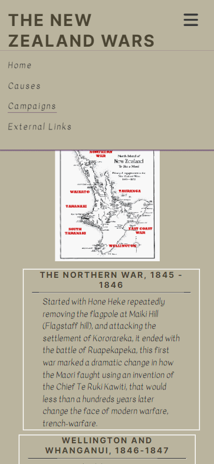
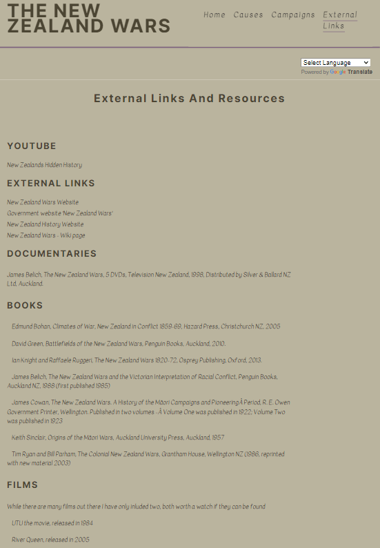
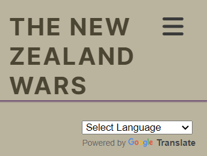
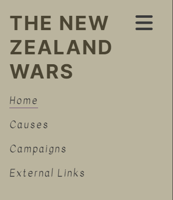
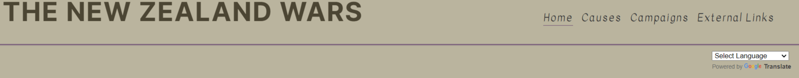
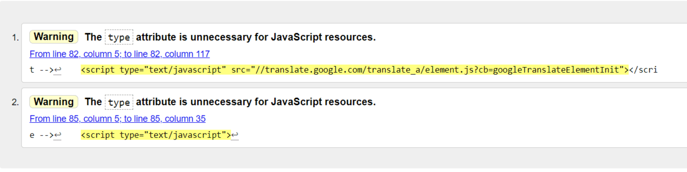
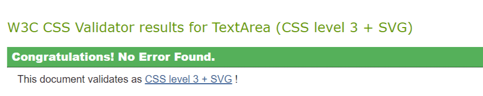

# The New Zealand Wars

[Link to live Website](https://swewi.github.io/NZ-Wars-A-brief-overview/index.html)

# Purpose

The idea behind this website is to introduce people to the New Zealand Wars, this is part of history that was barely taught when I was at school.
In an effort to improve the information around this subject the website is designed to deliver core information with external links to more indepth sources.

# UX
### Users

 - As a first time user I want them to be caught by the images, and easy to use layout.
 - As a returning user I want them to actively interact with the external links and investigate further into the site.

I have attempted to make this website as accesable as possible and as adaptable to various screen sizes.

# Structure
### Home Page

 

The home page is designed to attract attention, I have used a large 'Hero Image' and colour that not only compliment the image but have a relaxing feel.  The Hero Image selected is relavent to the content, as well as possibly drawing people to the site.

The secondary images I used are 'classsic' New Zealand images that people associate with the country. Alonside text that draws attention to the reasons why the site was designed.

### Causes Page

The page is very wordy, by it's nature history often is, I have tried to break it up by using style elements to push bits around the page and added a couple of images, the page retains a logical structure despite the slightly random placing of elements.

I kept order by placing boxes around elements to define them, and draw them together at the same time.

Simulation of iPad mini on causes page.

### Campaigns Page

This page acts as a sort of timeline, with a very brief rundown of the individual campaigns, the map image at the top is kept relatively small because it is a poor quality image, however it was the best I could find.  While this page's details are brief there is an extensive 'external links' page with lots of extra sources of info.

Simulation of Samsung Fold (on the left), and Samsung s20 (on the right), on the campaigns page.

### Consequences Page
##### - This page is retained within the README as it is a future feature, it is completely hidden from the user.

### External links and Resources Page

This page contains links to useful websites to extend knowledge base, and some useful publications, including a DVD set that remains the only documentary series on this subject ever produced.

Simulation of iPad Air on the external links page.

# Design

### Colour Scheme

I based my colour scheme around the location and time period of the Wars, I used iColorpalette to find colours that matched my needs, while maintaining a suitable level of contrast for low vision readers.

### Font

Google fonts has a huge range of fonts, for this project I choose two fonts with the 'Sans Serif' fall back.

The font I choose for all the headers was 'Inter' it has a nice smooth look while being blocky enough to resize nicely aacross several header sizes:

The font I choose for all the text was 'Kavivanar', this font was an interesting choice, but it does work, it adds a nice periody,hand writen style to the text:

To highlight the sections within the 'External links and resources Page' I used a number of 'favicons', doing my best to use relavent images, I also used the 'classic' burger icon for the mobile menu drop down.

# Features

### Navigation Bar

I have made the navigation bar as responsive as possible, it is fully interactable at all sizes, in the smallest form the menu operates from a classic 'burger' icon:

 

It opens up to look like this:

 

For screens 768px and larger the menu expands fully into a traditonal 'tab' style:

 

Each menu page connects with every other page.

### Resposive Design

I have done my best to make this project as responive as possible, elements move when the screen resizes, I will admit the code is not pretty as I would like however, I have done the best I can.  There are several media querries to allow for multiple screen sizes.

### Accessibility

I have done my best to ensure accessibility across all the tabs, I have included a google translate button on all pages, unfortunately I copied and pasted this element and do not really understand how it works so it maybe a little janky.

I have maintained a level of contrast between the text and background throughout so people with low-vision can read, with or without a screen reader.

## Future Features
- Add a consequences page, outlining both long and short term consequences of the wars.
- Expand the information on each of the pages to make the whole project feel more complete.
- Add more images to varous pages and sections, but must be non-copyrighted.

# Technologies

This is a list of technologies used during the construction and testing of the site:
***
* HTML to accomplish the structure of the website.
* CSS to style the website.
* [Gitpod](https://gitpod.io/workspaces) IDE to develop the website.
* [Github](https://github.com/Swewi) To host the source code and GitHub Pages to deploy and host the live site.
* Git to provide version control (to commit and push code to the repository).
* [FontAwesome](https://fontawesome.com/) Version: 6.5.1 Icons.
* [Goggle Fonts](https://fonts.google.com/) For website fonts.
* [Google Dev Tools](https://developer.chrome.com/docs/devtools/) For page inspection and checking website.
* [CloudConvert](https://cloudconvert.com/avif-to-webp) For image conversion.
* [TinyJPG](https://tinyjpg.com/) For image compression.
* [Favicon](https://favicon.io/) To create favicon for the website.
* [iColorpalette](https://icolorpalette.com/#google_vignette) To create the colour palette for the project.
* [Am I Responsive](https://ui.dev/amiresponsive) To create mockup image for README.
* Google Chrome's [Lighthouse](https://developer.chrome.com/docs/lighthouse/overview/) to check accessibility.
* [NVDA screen reader](https://www.nvaccess.org/) to access screen reader capabilities on website.
* [Colorfilter](https://www.toptal.com/designers/colorfilter/) to check website for colour-blind accessibility.
* [W3C HTML Markup Validator](https://validator.w3.org/) to check HTML code.
* [W3C Jigsaw CSS Validator](https://jigsaw.w3.org/css-validator/) to check CSS code.
* Code Institute's Gitpod Template to generate the workspace for the project.

# Testing

### Accessibility

I have run tests checking accessibility of the site using:
***
* Screen readers
    - the screen reader could passably read the site and alt/aria tags, the pronunciation of the Maori words is interesting.
* Colour blind check
    - the site looked useable, and it was readable.
* Vision Imparied
    - the use of alt-tags and aria-labels throughout the document to maximise usage by vision impaired users.

### Code

I have checked the code using W3C HTML validator - No errors occured.

!I have only added the HTML screenshoot because every sheet had the same output!

I have checked the code wsing W3C CSS validator - No errors occured.

I have tried to ensure regular commits occured and that things have been commented correctly.

#### Lighthouse output

Outcome of testing, while the interface works well, there are some issues, I have no understanding of the google translate code, so I can't fix that one.  I have done my best to replace images with smaller versions, but I have been unable to re-run lighthouse to check new values.

# Deployment
## Cloning the Repository

* On Github navigate to the repository "https://github.com/Swewi/NZ-Wars-A-brief-overview/tree/main"
* Click "Code" drop down menu - a green button shown right above the file list.
* Copy the URL of the repository using "HTTPS", "SSH" or "Github CLI".
* Open Git Bash.
* Change the current working directory to the location where you want the cloned directory.
* Type "git clone", and then paste the URL copied earlier.
* Press enter to create local clone. A clone of the repository will now be created.

* For more details on how to clone the repository in order to create a copy for own use refer to the site:
[Cloning a Repository](https://docs.github.com/en/repositories/creating-and-managing-repositories/cloning-a-repository)

## Forking a Repository

* On Github navigate to the repository "https://github.com/Swewi/NZ-Wars-A-brief-overview/tree/main"
* Click "Fork" located towards top right corner on GitHub page.
* Select "owner" for the forked repository from the dropdown menu under "owner".
* It will create forked repo under the same name as original by default. But you can type a name in "Repository name" or add a description in "Description" box.
* Click on "Create fork". A forked repo is created.

###### Important Information about forking a repository
* Forking allows you to make any changes without affecting original project. You can send the the suggestions by submitting a pull request. Then the Project Owner can review the pull request before accepting the suggestions and merging them.
* When you have fork to a repository, you don't have access to files locally on your device, for getting access you will need to clone the forked repository.
* For more details on how to fork the repo, in order to for example suggest any changes to the project you can:
[Forking a Repository](https://docs.github.com/en/get-started/quickstart/fork-a-repo)

## Deploying

This project was deployed to GitHub pages. The steps to deploy are as follows:

1. Log into GitHub.
2. Select `NZ-Wars-A-brief-overview` from the list of repositories.
3. Select `Settings` From the Repositories sub-headings.
4. In the left side menu select `Pages` from `Code and automation` section.
5. Under the `Source` heading in the dropdown menu select `main`.
6. A second drop-down menu should remain with the default value `/(root)`.
7. Press `Save`.
8. A message that the website is ready to be deployed will appear, refresh the page and the link to the deployed site will be available in a green sub-section on the top of the page.
9. Click on the link to go to the live deployed page.

# Credits

### Media
***
* [Ruapekapeka Pa Gate](https://walkinnz.home.blog/) sourced from the history hits website.
* My own photos.
* [National library of NZ - Various images](https://natlib.govt.nz/schools/topics/5d24041bfb002c625d9dc3f2) Historic images.
* [Almy - Various images](https://www.alamy.com/stock-photo/new-zealand-wars.html?sortBy=relevant) Historic images.
* [Getty Images - Various images](https://www.gettyimages.com.au/photos/maori-war) Historic images.
* [NZ wars documentary](https://www.youtube.com/watch?v=oP-rFLSwMPk&list=PLjXjdTq37-vSip6Wv3kbMBvrIT9Xr2KFq) Prof. James Belich New Zealand Wars, I have got permission from Prof. Belich to use this media.

### Code
I used W3 Schools for help with syntax and making some parts of the website work.

I referenced The Code Institute Walkthrough project - Love Running, and the Coffee Coders project as references for parts of code, as well as flicking through the HTML and CSS sections to get the correct syntax.

## Acknowledgements

I would like to acknowledge my partner for being incrediably understanding when I am working over weekends and late into the night.  

I would also like to acknowledge my mentor Ronan for his help.
